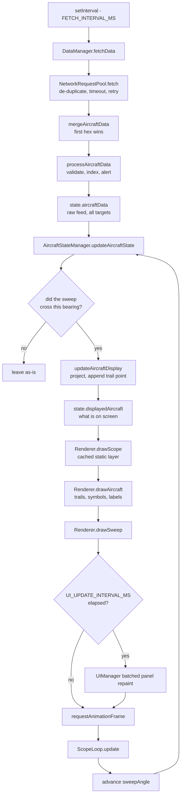

# Architecture

How ADSB Radarscope is put together, for anyone modifying it. For settings,
see [CONFIG_EXAMPLE.md](CONFIG_EXAMPLE.md); for installation and use, see
[README.md](../README.md).

## Contents

- [Shape of the application](#shape-of-the-application)
- [Modules](#modules)
- [The frame cycle](#the-frame-cycle)
- [Why the sweep gates updates](#why-the-sweep-gates-updates)
- [A receiver that moves](#a-receiver-that-moves)
- [Two rendering layers](#two-rendering-layers)
- [Coordinate systems](#coordinate-systems)
- [State](#state)
- [Persistence](#persistence)
- [Error handling](#error-handling)
- [Performance decisions](#performance-decisions)
- [Extending the application](#extending-the-application)

## Shape of the application

Four files, no build step, no framework, no dependencies:

```
index.html    markup, panel structure, modals
config.js     CONFIG, UI_THEMES, SCOPE_THEMES, SCOPE_THEME_COLORS
app.js        the entire application, in one IIFE
styles.css    theme custom properties and component styles
```

Plus two data inputs: the OurAirports CSVs under `data/`, and — for a receiver
that moves — a `POSITION` file rewritten by whatever produces the fix.

Scripts load in order — `config.js` defines globals that `app.js` reads at
parse time, so the order is not incidental.

`app.js` is wrapped in a single IIFE under `'use strict'`. Nothing leaks to
`window` except `window.EventHandlers`, which exists only so the inline
`onclick` handlers on the settings-panel Remove buttons can reach it.

Inside the IIFE, the code is a set of single-instance namespaces (plain object
literals) plus three classes that are instantiated more than conceptually
once: `StateManager`, `ObjectPool`, `CanvasRenderer` and `NetworkRequestPool`.

## Modules

| Module | Kind | Responsibility |
|---|---|---|
| `StateManager` | class | Proxy-backed observable state |
| `ObjectPool` | class | Recycles short-lived objects |
| `CanvasRenderer` | class | Static scope layer, and its bitmap cache |
| `NetworkRequestPool` | class | Request de-duplication and timeouts |
| `ErrorBoundary` | namespace | Central error handling and user-visible banners |
| `MemoryManager` | namespace | Periodic reclamation of stale aircraft and trails |
| `MathUtils` | namespace | Geodesy: distance, bearing, projection, dead reckoning |
| `TooltipManager` | namespace | Pointer-following tooltips, tap-to-show on touch |
| `SoundManager` | namespace | Web Audio alert tones |
| `ThemeManager` | namespace | Applies UI themes, resolves scope colour roles |
| `URLValidator` | namespace | Validates and sanitises data-source URLs |
| `CSVDataManager` | namespace | Loads and queries airports, navaids, runways |
| `PositionManager` | namespace | Tracks a moving receiver from the POSITION file |
| `DataManager` | namespace | Polls feeds, merges, validates, classifies |
| `Renderer` | namespace | Dynamic layer: sweep, symbols, trails, labels |
| `UIManager` | namespace | Tables, metrics, status bar, popups, alerts |
| `ExportManager` | namespace | CSV, KML and JSON statistics export |
| `AircraftStateManager` | namespace | Sweep-gated promotion of targets to the display |
| `EventHandlers` | namespace | All input; settings modal; UI persistence |
| `ScopeLoop` | namespace | The requestAnimationFrame driver |
| `App` | namespace | Startup and teardown |

Dependencies run roughly downward in that table. There is no dependency
injection: modules reference each other directly by name, relying on the fact
that `const` declarations in the same closure are all initialised before
`App.init()` runs.

## The frame cycle

Data moves one way through each cycle.



Two independent clocks drive this: a `setInterval` at `FETCH_INTERVAL_MS`
(1 s) for the network, and `requestAnimationFrame` throttled to
`CANVAS_RENDER_THROTTLE_MS` (16 ms) for rendering. They meet only through
`state.aircraftData`, so a slow feed degrades freshness without affecting
frame rate, and a slow frame does not delay polling.

A third, slower cadence sits on top: the side panels repaint every
`UI_UPDATE_INTERVAL_MS` (700 ms), because rebuilding a table is far more
expensive than repainting a canvas.

## Why the sweep gates updates

The distinction between `state.aircraftData` and `state.displayedAircraft` is
the central design decision, and everything else follows from it.

`aircraftData` is the raw feed — every valid target, replaced wholesale each
poll. `displayedAircraft` is what the scope shows, and a target only moves
from one to the other when the sweep line passes over its bearing
(`AircraftStateManager.isInSweepArea`). Targets therefore "paint" in as the
sweep reaches them, exactly as on a real PPI display, instead of all jumping
at once each second.

Consequences worth knowing before changing anything here:

- A displayed position may be up to one full revolution
  (`SWEEP_DURATION_S`) behind the feed. That is intended.
- Symbol alpha fades over one sweep period, so a target dims until repainted.
- The aircraft timeout is measured in sweeps
  (`SWEEP_DURATION_S × AIRCRAFT_TIMEOUT_FACTOR`), not in absolute seconds —
  slowing the sweep also lengthens how long a silent target lingers.
- Setting `SWEEP_DURATION_S` to `0.0` removes the gate entirely, and with it
  the radar behaviour.

`isInSweepArea` compares the previous and current sweep angles and handles the
360° → 0° wrap, so no bearing is skipped on the frame where the sweep passes
through north.

Positions are smoothed before display. `SMOOTHING_FACTOR` blends each new
report with the last displayed position, damping the quantisation jitter that
is visible at short range; a jump over 2 nm is treated as a reposition and
snaps. The trail records the smoothed track, so the symbol always sits on the
head of its own trail rather than beside it.

## A receiver that moves

`PositionManager` lets the scope centre follow a receiver aboard a ship or
vehicle, reading it from a `POSITION` file.

The browser cannot watch a file, so the file is polled with
`If-Modified-Since`/`If-None-Match`; an unchanged file costs a `304` and nothing
downstream runs. Servers that ignore conditional requests are handled by
comparing bodies. Four formats are accepted — NMEA 0183, JSON, `KEY=VALUE`,
bare pair — and every parsed fix is range-checked before use.

**The design pays off here.** Because every stored position is geographic and
projected per frame relative to `state.homeLat/homeLon`, moving the origin
re-projects aircraft, trails, airports, navaids and runways correctly with no
special-casing. Trails laid down before the ship moved stay geographically true
instead of smearing — the same property that makes zoom and resize correct.

Two things do need care, and both are handled in `PositionManager.applyFix`:

- **The distance memo is keyed on coordinate pairs including home**, so
  `MathUtils._cache` is cleared when the origin moves.
- **The static layer was rasterised for the old origin.** Its cache key includes
  `state.staticEpoch`, a counter bumped only when the receiver has actually
  travelled past `MIN_MOVE_NM`. Without that counter the key would either miss
  the move entirely (stale rings and airports) or change on every GPS jitter
  (a full re-raster several times a second, forever, on a moored vessel).

The status bar switches from `POS:` to `UNDERWAY:` with course and speed, and a
fix older than `STALE_AFTER_MS` is marked `(STALE)` with the own-ship marker
dimmed to the emergency colour — a dead GPS feed should be visible on the scope,
not only in a log.

## Two rendering layers

The canvas is painted in two passes with very different cost profiles.

**Static layer** — `CanvasRenderer`. Background, range rings and their labels,
compass rose, airports, navaids, runways. These change only when the range,
layer toggles, theme, canvas size or home position change, so the layer is
rasterised once — on an `OffscreenCanvas` where the browser has one, otherwise a
scratch `<canvas>` — and cached as `ImageData`. The cache key is:

```
`${cx}-${cy}-${radius}-${maxRangeNm}-${showAirports}-${showNavaids}-${showRunways}-${scopeThemeIndex}-${staticEpoch}`
```

On a miss it is redrawn and re-cached. Any code that changes something in that
key must call `Renderer.markForRedraw()`, or the screen will not update.

On a hit, the frame does **not** blit the whole bitmap. With
`DIRTY_REGION_TRACKING` on, every draw call in the moving layer records its
bounding box through `CanvasRenderer.markDirty`; the next frame merges those
into horizontal bands and restores only those rectangles, which erases the
moving layer without repainting the scope face. Above 55% coverage
(`CanvasRenderer.DIRTY_AREA_LIMIT`) it falls back to one full restore, because
many small blits then cost more than one big one. A rebuilt cache always lands
in full.

The consequence for anyone adding to the moving layer: **whatever you paint,
mark dirty** — otherwise the next frame will not erase it and it will smear
across the scope.

**Dynamic layer** — `Renderer`. Sweep, trails, symbols, labels, debug overlay.
Redrawn every frame.

Within the dynamic layer, targets are bucketed by category (emergency,
selected, mlat, adsb, other) before drawing, so each colour is set once per
category rather than once per aircraft.

Label placement is the most expensive step. Each data block tries up to twelve
positions on a circle around its target and takes the first that stays
on-canvas and does not overlap a label already placed this frame. If all
twelve collide the label is dropped rather than drawn illegibly — so in dense
traffic some targets show no data block, by design.

## Coordinate systems

Three, and confusing them is the easiest way to introduce a bug:

1. **Geographic** — latitude/longitude in decimal degrees. Everything is
   stored in this form.
2. **Compass** — degrees true, 0° = north, increasing clockwise. What
   `MathUtils.bearing` returns and what aircraft report as `track`.
3. **Canvas** — pixels, 0° = east (positive X axis), increasing clockwise
   because Y grows downward.

Compass converts to canvas by subtracting 90°. `MathUtils.latLonToScreen`
does this; `drawCrosshairsAndTicks` adds 270°, which is the same rotation.

Distances are nautical miles throughout, using an earth radius of
3440.065 nm. Altitudes are feet, speeds knots — the units the feed uses —
and are converted only on KML export, which needs metres.

## State

`StateManager` wraps a plain object in a `Proxy` whose setter notifies any
callbacks subscribed to that property. Note the limits:

- **Only top-level properties are observed.** `state.selectedHex = x` fires;
  `state.sessionStats.messagesReceived++` does not.
- With `IMMUTABLE_STATE_UPDATES` on, object values are deep-cloned on
  assignment through `JSON.parse(JSON.stringify(...))`. That prevents aliasing
  bugs, at the cost of a clone per write — and it silently converts a `Set` to
  `{}`, which matters if you add one to the state object.

The state object holds five kinds of thing:

| Kind | Examples |
|---|---|
| Feed data | `aircraftData`, `displayedAircraft` |
| Session statistics | `sessionStats`, `fps`, `frameCount` |
| Reference data | `airports`, `navaids`, `runways`, `dataLoaded` |
| User settings and layer toggles | `homeLat`, `maxRangeNm`, `showTrails`, `uiTheme` |
| Teardown handles | `eventListeners`, `intervals`, `timeouts` |

That last group is what makes a clean shutdown possible: every listener goes
through `EventHandlers.addEventListenerWithCleanup` and every timer is pushed
onto `state.intervals` / `state.timeouts`, so `App.cleanup` can remove all of
them on `beforeunload`.

## Persistence

Three `localStorage` keys, written debounced by
`PERFORMANCE.LOCALSTORAGE_DEBOUNCE_MS`:

| Key | Written by | Contents |
|---|---|---|
| `adsbScope_settings` | Save in the settings modal | Home position, data sources, layer toggles, trail settings |
| `adsbScope_uiState` | Panel and selection changes | Section expansion, selected aircraft, current range |
| `adsbScope_uiTheme` | Theme dropdown | UI theme key |

`App.loadSettings` reads all three at startup, in that order — so `uiState`
wins over `settings` for the keys they share. Booleans are compared strictly
(`=== true`), so a stale truthy value cannot silently re-enable a layer the
user turned off.

Stored settings shadow the corresponding `config.js` defaults on every load
after the first save. This is the usual reason an edit to `config.js` appears
to have no effect.

## Error handling

Every subsystem routes failures to `ErrorBoundary.handleError`, which logs,
shows a banner and reports to `gtag` when one is present. Nothing throws past
its own module. In particular:

- **Feed failures are per-source.** `Promise.allSettled` over the enabled
  sources leaves the healthy ones working, with the status bar showing
  `Partial (n failed)`. Results are paired with their source before filtering,
  so a warning names the feed that actually failed, and each outage is reported
  once rather than once per poll.
- **A failed POSITION read does not stop tracking.** The poller keeps going and
  warns once after three consecutive failures; the last known fix stays on
  screen, marked stale.
- **Reference-data failures are per-file.** A missing `runways.csv` costs the
  runway layer and nothing else.
- **A thrown frame does not kill the loop.** `ScopeLoop.update` catches,
  reports, and schedules the next frame regardless.
- **Missing DOM nodes are tolerated.** `elements` entries may be `null`, and
  callers use optional chaining.

Global `error` and `unhandledrejection` listeners catch whatever escapes. Note
the `.catch(() => {})` after the bookkeeping `.finally()` in
`NetworkRequestPool.fetch`: `.finally()` returns a *derived* promise, and
without that catch every failed request would surface as an
`unhandledrejection` and raise a spurious error banner.

## Performance decisions

Each of these exists for a specific reason:

**Distance memoisation.** `MathUtils.haversineDistance` caches on coordinates
rounded to four decimals (~11 m), because filtering airports and navaids
recomputes the same pairs many times per frame. Capped at 1000 entries,
evicted oldest-first.

**Geographic trails.** Trails store lat/lon and are re-projected each frame,
not cached as pixels. Costs one projection per point per frame; buys correct
history across zoom and resize. This is the main reason `MAX_TRAIL_LENGTH` is
the first thing to reduce on slow hardware.

Measured over an 800-frame run: 1 static render, 799 restores — of which 118 of
120 were partial in the feature-suite run.

**Trail projection memo.** `drawAircraftTrail` caches its screen projection in a
`WeakMap` keyed by the aircraft's display entry, invalidated by a key covering
range, geometry, home position and trail length. Between sweeps a trail does not
change, so most frames reuse the projection instead of re-running one
`latLonToScreen` per point. Keying on the entry object means the cache is
reclaimed when the aircraft is dropped, with no eviction pass.

**Trail segment cap.** `TRAIL_GRADIENT_SEGMENTS` resamples a long trail down to
at most N stroked segments — 100 points at 40 segments looks the same and costs
less than half as much.

**Object pooling.** Trail points churn thousands of small objects a minute.
`trailPointPool` recycles them, so the allocation rate stays low enough that
GC pauses do not show up as stutter in the sweep.

**Request pooling.** `NetworkRequestPool` shares one in-flight promise per
URL. Without it, a source slower than `FETCH_INTERVAL_MS` accumulates a fresh
request every second on top of the ones still open.

**DOM batching.** `UIManager` marks panels dirty and repaints them together in
one animation frame, so a burst of state changes costs one layout pass. Table
rows are assembled in a `DocumentFragment` and appended once.

**Symbol contrast.** Aircraft symbols are drawn +60 per RGB channel brighter
than their own trail, so a target stays legible against its own history.

## Extending the application

**Add a scope theme.** Append to `SCOPE_THEMES` and add the matching entry to
`SCOPE_THEME_COLORS` with all eleven roles. Append, never reorder — the stored
choice is the array index. See [CONFIG_EXAMPLE.md](CONFIG_EXAMPLE.md#themes).

**Add a UI theme.** Append to `UI_THEMES` with a `group`, and add a
`[data-ui-theme="your-key"]` block to `styles.css` defining the custom
properties.

**Add a keyboard shortcut.** Add a `case` to `EventHandlers.handleKeydown` and
an entry to the `shortcuts` map in `UIManager.createShortcutBar` — that map
feeds both the bottom bar and the help modal.

**Add a display layer.** Add the toggle to state, draw it inside
`CanvasRenderer.drawStaticScope` if it is static, add its toggle to the
`cacheStaticElements` cache key, and call `Renderer.markForRedraw()` when it
changes. Skipping the cache key is the classic mistake: the layer toggles in
state and nothing happens on screen. If the layer is dynamic instead, call
`canvasRenderer.markDirty()` over what you paint or the next frame will not
erase it.

**Add a POSITION file format.** Write a `parseX` method on `PositionManager`
returning an `OwnPositionFix`, and add it to the chain in
`PositionManager.parse`. Return `null` on no match — but note that NMEA is
claimed exclusively: a body starting with `$` is only ever offered to
`parseNMEA`, so a rejected sentence cannot fall through to `parseBarePair` and
be misread as coordinates.

**Add a setting to the panel.** Add the control to `index.html`, read it in
`EventHandlers.showSettings`, write it in `saveSettings`, persist it in the
`settings` object there, and restore it in `App.loadSettings`. Values that live
on `CONFIG` rather than `state` go under the `display` or `performance` keys.

**Add an export format.** Add a method to `ExportManager` that builds a string
and calls `downloadFile`, then add it to the prompt in
`EventHandlers.showExportMenu`.

**Add a metric.** Compute it in the single pass in
`UIManager.calculateMetrics` and render it in `updateMetricsPanelInternal`.
Avoid adding a second pass over `displayedAircraft`.

Two things to keep in mind wherever you extend:

- Register listeners through `addEventListenerWithCleanup` and push timers
  onto `state.intervals` / `state.timeouts`, or they will survive teardown.
- Anything that changes the static layer must invalidate its cache.

## Audit status

The behaviour described here was verified by executing the source in a DOM
environment, not by reading it: 31 boot-and-render checks, 46 feature checks
covering the moving receiver and every previously-inert setting, 8 multi-source
resilience checks, and a reproduction suite for the twelve defects found in the
`0.0.1` audit — all of which now fail to reproduce.

Those suites live in [`test/`](../test/README.md) and run with `npm test`. If you
change anything described in this document, they are how you find out whether
the description is still true.

[KNOWN_ISSUES.md](KNOWN_ISSUES.md) keeps the record of what was wrong and how
each was fixed.
